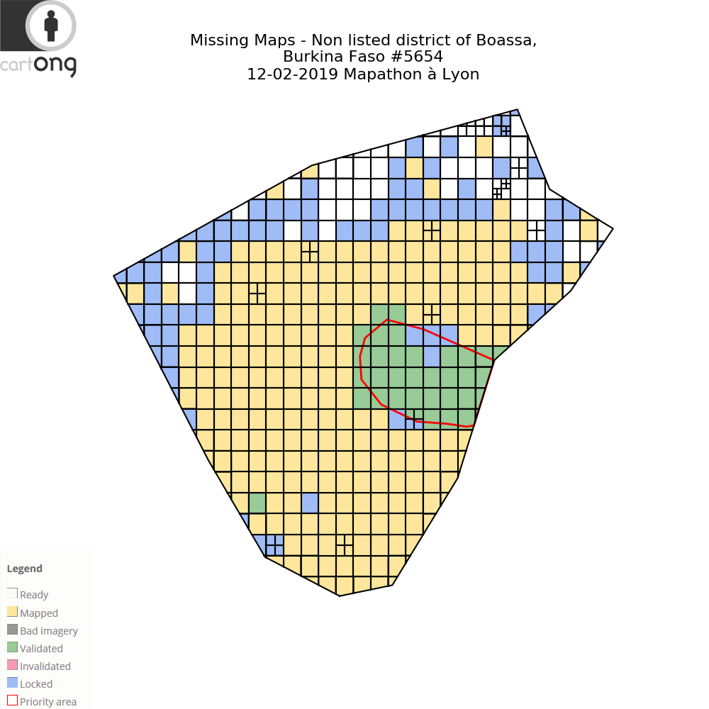
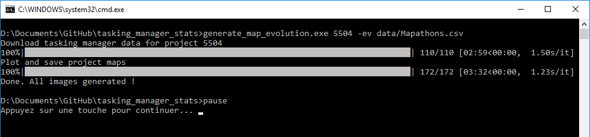

# Tasking manager stats
> Various stats and visualizations computed from HOT tasking manager data to promote missing maps activity

## Map evolution

The visualization proposes to see again the map of the tasking manager day by day.

Technically it generates a directory of images which can be used to do a video.
Example of this image generation: 




### Basic Installation

#### Windows

- [Download the archive](https://drive.google.com/open?id=1EKbJn4NxjA8fYNR-NTT-KpiaSSJNiU0L)
- Extract the archive

#### Linux/Mac

Will be done if asked

### Contributor Installation

If you want contribute to the project or 

[Install conda](https://docs.conda.io/en/latest/miniconda.html)

Create a conda environment
````
conda create -n tasking_manager_stats python=3.6
````

Activate the conda environment
````
activate tasking_manager_stats
````

Install the packages with the following command
````
conda install pillow tqdm pandas matplotlib numpy requests
````

#### Optionnal

If you want release your development, you can use the Pyinstaller package.

There is currently an issue in the latest release of Pyinstaller
which is fixed in the develop branch. To install it, run the following command.

````
pip install https://github.com/pyinstaller/pyinstaller/tarball/develop 
````

To release, run the following command
````
pyinstaller tasking_manager_stats/generate_map_evolution.py -F
````


### Usage
#### Windows

* Open *generate_map_evolution.bat* with a text editor.
* Replace *5504* by the id of the tasking manager project
* Replace *data/Mapathons.csv* by the path of the CSV file
or remove *-ev data/Mapathons.csv* if you don't want event
* Save your edit
* Double click on *generate_map_evolution.bat*

If there was no issue, you will have something like this.



In the directory *data/<project_id>* you will find all the images.
You can find a tutorial on [how using these images to do a video with OpenShot Video Editor in the wiki](https://github.com/NicolasGrosjean/tasking_manager_stats/wiki/How-to-create-a-video-from-the-generated-images-with-OpenShot-Video-Editor).

#### Linux/Mac

Will be done if asked

#### Contributor

Run the following command to know the parameters.

````
python tasking_manager_stats/generate_map_evolution.py -h
````

## Statistics

### Export task data of a project
Export task data in a CSV file (in data/stats/) for a HOT tasking manager project.
```
python tasking_manager_stats/export_tasks_to_csv.py <project_id>
```

Example:
```
python tasking_manager_stats/export_tasks_to_csv.py 5654
```

### Merge all data
Merge all the task data located in data/stats/ directory.
```
python tasking_manager_stats/merge_stats.py
```

### Filter merged data between two dates
Filter the merge data between two included dates.
```
python tasking_manager_stats/filter_merge_stats.py <min_date> <max_date>
```

Example:
```
python tasking_manager_stats/filter_merge_stats.py 01-07-2018 30-06-2019
```

### Export user stats on merge data
Get users data from the HOT tasking manager API.
```
python tasking_manager_stats/get_user_stats.py <stats> <token>
```

Example:
```
python tasking_manager_stats/get_user_stats.py ../data/merged_stats.csv <token>
```

*token* must be replaced by the API key of HOT tasking manager API
which can be get in [the settings](https://tasks.hotosm.org/settings).

### Aggregate user stats on merge data
Aggregate users data from the merge data.
```
python tasking_manager_stats/agregate_user_stats.py <merged_stats> <stats_one_author> <mapathon_file> -max_date <YYYY_MM_DD>
```

Example to get latest data :
```
python tasking_manager_stats/get_user_stats.py ../data/merged_stats.csv ../data/merged_stats_one_author_by_task_type.csv ../data/mapathons.csv
```

Example to create a dataset to predict contributors who come back in 2020 :
```
python tasking_manager_stats/get_user_stats.py ../data/merged_stats.csv ../data/merged_stats_one_atuhor_by_task_type.csv ../data/mapathons.csv -max_date 2019_12_31
```

### Get final date of Tasking Manager project
Get the date of the latest validation of a HOT tasking manager project.
```
python tasking_manager_stats/get_final_date.py <project_id>
```

Example:
```
python tasking_manager_stats/get_final_date.py 5654
```

### Compute some stats about Tasking Manager project
Print some stats about a HOT tasking manager project.
```
python tasking_manager_stats/project_stats.py <project_id>
```

Example:
```
python tasking_manager_stats/project_stats.py 5654
```

### Compute contribution stats with ohsome
Print some ohsome stats about a HOT tasking manager project.
```
python stats_ohsome.py <project_id>
```

Example:
```
python stats_ohsome.py 5654
```

### Compute stats to update
Print some stats about updated HOT tasking manager projects.
```
python update_stats.py <input_file>
```

*input_file* contains the list of project ids with one id by line.

It is better to put all the project ids because if the project has not been updated,
there is no computation and the script look at the next project.

## License

Tasking manager stats is released under the [MIT License](http://www.opensource.org/licenses/MIT).
